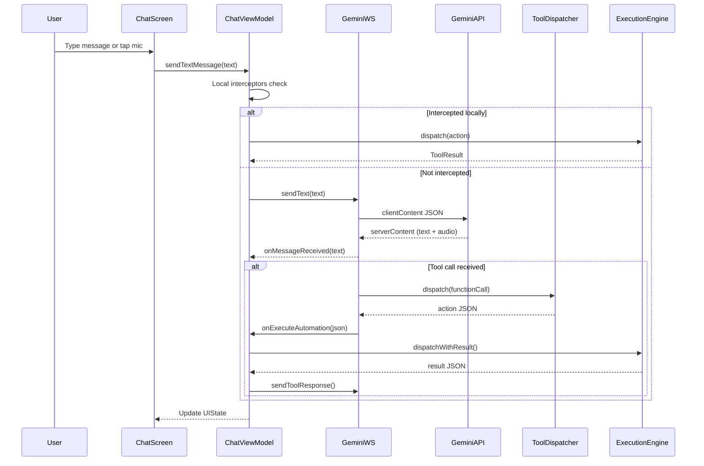
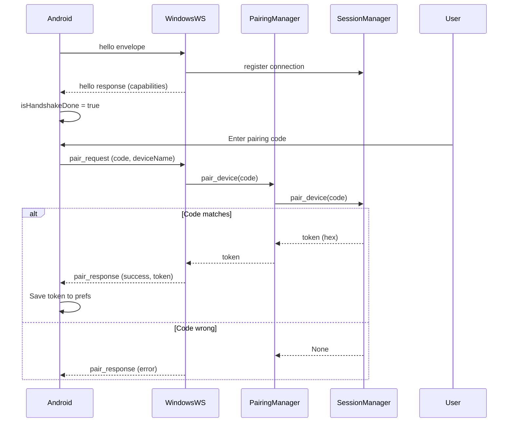
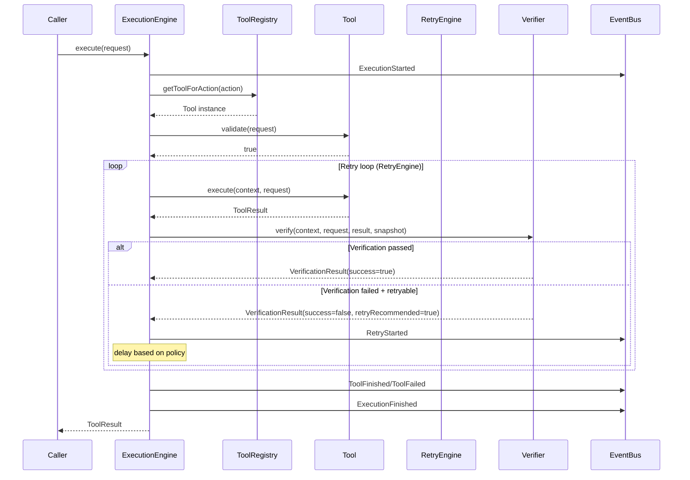
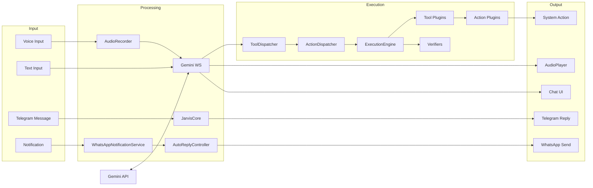

# MAX AI Agent - Complete Project Documentation

> **Generated:** 2026-07-20 | **Version:** 1.0 | **Protocol Version:** 1 (Frozen)

---

# 1. Project Overview

## Purpose
MAX is a dual-component AI assistant platform consisting of:
1. **Android Application** - A full-featured AI voice/text assistant ("MAX") that connects to Google's Gemini AI model via WebSocket for real-time bidirectional conversations
2. **Windows Companion Agent** - A Python-based server that the Android app connects to over LAN for remote Windows PC automation

The system was originally generated from Google AI Studio and then extensively customized with 30+ on-device automation tools, voice interaction, and cross-platform control.

## Main Features
- **Real-time Voice Conversation** via Gemini Live WebSocket API (16kHz PCM audio)
- **30+ Device Automation Tools** (app control, messaging, system settings, camera, etc.)
- **WhatsApp/Telegram/Instagram Integration** via accessibility service and notification listener
- **Windows PC Remote Control** via LAN WebSocket pairing
- **Voice Activity Detection** with 30-second silence timeout
- **Task Scheduling** with AlarmManager-based execution
- **Period Health Tracking** with cycle predictions
- **Smart Auto-Reply** with regex matching and AI fallback
- **Shizuku Integration** for root-adjacent privileged operations
- **Operations Console** (web dashboard for the Windows agent)

## Target Users
- Android users who want hands-free device control via voice
- Users who want to control their Windows PC from their Android phone
- Power users who want automated WhatsApp/Telegram responses
- Users in India/Telugu-speaking regions (Telugu/Tenglish language support)

## Overall Architecture

```
                    +---------------------------+
                    |      Google Gemini API     |
                    |   (BidiGenerateContent)    |
                    |   WebSocket: wss://...     |
                    +-------------+-------------+
                                  |
                                  | Gemini Live WebSocket
                                  |
+------------------+    +---------v----------+    +---------------------+
|   User (Voice/   +--->|  Android App       |<-->| MAX Windows Agent   |
|   Text Input)    |    |  (MAX AI Agent)    |    |  (Python Server)    |
+------------------+    |                    |    |  WS:9000 HTTP:9001  |
                        |  - Gemini WS Client|    |  - CmdTool          |
                        |  - 30+ Tools       |    |  - PairingManager   |
                        |  - Voice Engine    |    |  - EventBus         |
                        |  - Room DB         |    |  - Dashboard (HTML) |
                        |  - Shizuku Access  |    +---------------------+
                        +--------------------+
```

## Technology Stack

### Android App
| Category | Technology |
|----------|-----------|
| Language | Kotlin 2.2.10 |
| UI Framework | Jetpack Compose (BOM 2024.09.00) |
| Build System | Gradle Kotlin DSL (AGP 9.1.1) |
| AI Model | Google Gemini (gemini-3.1-flash-live-preview) |
| Networking | OkHttp 4.10.0 (WebSocket), Retrofit 2.12.0, Gson |
| Database | Room 2.7.0 |
| Code Generation | KSP 2.3.5 |
| Coroutines | 1.10.2 |
| Privileged Access | Shizuku 13.1.5 |
| Firebase | AI SDK, App Check reCAPTCHA |
| Testing | JUnit, Robolectric 4.16.1, Roborazzi 1.59.0 |

### Windows Agent
| Category | Technology |
|----------|-----------|
| Language | Python 3 |
| Networking | websockets >= 12.0 |
| HTTP Server | Built-in asyncio + http.server |
| Dashboard | Vanilla HTML/CSS/JS |
| Architecture | Async (asyncio), 5-layer boundary |

## Folder Structure

```
gemini-live/
├── app/                          # Android application
│   ├── build.gradle.kts          # App-level Gradle build config
│   ├── proguard-rules.pro        # ProGuard rules (empty)
│   └── src/main/java/com/example/
│       ├── MainActivity.kt       # Entry point, Compose UI
│       ├── MyApplication.kt      # Application class, tool registration
│       ├── automation/           # Device automation framework
│       │   ├── tools/            # 30+ tool implementations
│       │   ├── actions/          # Low-level system actions
│       │   ├── verification/     # Post-action verification
│       │   ├── scheduler/        # Task scheduling
│       │   ├── engine/           # Execution engine
│       │   └── event/            # Automation event system
│       ├── core/                 # Core framework (EventBus, State, Registry)
│       ├── data/                 # Room database, preferences, repository
│       ├── knowledge/            # Installed apps knowledge base
│       ├── network/              # Gemini WS client, ToolDispatcher, PromptBuilder
│       │   └── agent/            # Windows Agent bridge
│       ├── receiver/             # Broadcast receivers
│       ├── security/             # Screen unlock, lock automation
│       ├── service/              # Android services
│       ├── telegram/             # Telegram cloud integration
│       ├── ui/                   # Screens and theme
│       ├── utils/                # Helpers
│       ├── viewmodel/            # ChatViewModel
│       └── voice/                # Voice subsystem
│           ├── audio/            # Audio stack
│           ├── assistant/        # Assistant engine
│           ├── session/          # Voice interaction services
│           ├── tools/            # Voice tool registry
│           ├── trigger/          # Voice trigger activity
│           └── ui/               # HUD composables
│
├── max-windows-agent/            # Python Windows companion agent
│   ├── main.py                   # Entrypoint
│   ├── config.py                 # Configuration facade
│   ├── core/                     # State managers (4 singletons)
│   ├── protocol/                 # Protocol definitions (10 files)
│   ├── server/                   # Network layer (WS + HTTP + EventBus)
│   ├── tools/                    # Tool implementations (CmdTool)
│   ├── plugins/                  # Reserved for future plugins
│   ├── dashboard/                # Web SPA operations console
│   ├── tests/                    # Automated tests
│   ├── storage/                  # Runtime state
│   └── requirements.txt          # Dependencies
│
├── docs/                         # Architecture documentation
├── build.gradle.kts              # Root Gradle build
├── settings.gradle.kts           # Module configuration
├── gradle/libs.versions.toml     # Version catalog
└── .env.example                  # API key placeholder
```

---

# 2. Folder Analysis

## `app/src/main/java/com/example/automation/`
**Purpose:** Device automation framework - the core of MAX's device control capabilities.

| Subfolder | Purpose | Files | Connects To |
|-----------|---------|-------|-------------|
| `tools/` | Tool plugin implementations (34 files) | `Tool.kt`, `ToolRegistry.kt`, `ToolResult.kt`, + 30 tool classes | `actions/`, `verification/`, `engine/` |
| `actions/` | Low-level action executors (23 files) | `BaseAction.kt`, `JarvisAction.kt`, + 21 action classes | Android APIs (PackageManager, AudioManager, etc.) |
| `verification/` | Post-execution verification (25 files) | `Verifier.kt`, `VerificationRegistry.kt`, `RetryEngine.kt`, + 20 verifiers | `DeviceContext.kt`, `UiSnapshot.kt` |
| `engine/` | Orchestration layer (13 files) | `ExecutionEngine.kt`, `ActionDispatcher.kt`, `ExecutionRequest.kt` | `tools/`, `verification/`, `event/` |
| `scheduler/` | Task scheduling (14 files) | `TaskManager.kt`, `ScheduledTask.kt`, `TaskReceiver.kt` | Room DB, AlarmManager |
| `event/` | Automation event system (2 files) | `AutomationEvent.kt`, `AutomationEventBus.kt` | SharedFlow pattern |

## `app/src/main/java/com/example/voice/`
**Purpose:** Voice assistant subsystem - handles all audio I/O and voice interaction.

| Subfolder | Purpose | Files | Connects To |
|-----------|---------|-------|-------------|
| `audio/` | Audio stack (4 files) | `AudioRecorder.kt`, `AudioPlayer.kt`, `AudioProcessor.kt`, `AudioFocusManager.kt` | Gemini WebSocket, Android AudioRecord/AudioTrack |
| `assistant/` | Assistant engine (11 files) | `AssistantEngine.kt`, `ConnectionManager.kt`, `ConversationManager.kt` | `audio/`, `tools/`, `session/` |
| `session/` | Voice interaction services (6 files) | `JarvisVoiceInteractionService.kt`, `AssistantEngineService.kt` | Android Assist API |
| `tools/` | Voice tool registry (5 files) | `ToolRegistry.kt` (voice), `AuthorizationManager.kt`, `CapabilityProvider.kt` | `automation/tools/`, `automation/engine/` |
| `trigger/` | Voice trigger (1 file) | `JarvisVoiceTriggerActivity.kt` | Android Assist Intent |
| `ui/` | HUD composables (6 files) | `AssistantHud.kt`, `SoundWave.kt`, `GlowBorder.kt`, `TranscriptBubble.kt` | Compose UI |

## `app/src/main/java/com/example/data/`
**Purpose:** Data persistence layer.

| Subfolder | Purpose | Files |
|-----------|---------|-------|
| `local/` | Room database (14 files) | `AppDatabase.kt`, 7 entities, 7 DAOs |
| `preferences/` | SharedPreferences (1 file) | `SettingsManager.kt` (167 lines, 30+ settings) |
| `repository/` | Data repository (1 file) | `JarvisRepository.kt` |

## `max-windows-agent/`
**Purpose:** Python Windows companion agent for remote PC control.

| Subfolder | Purpose | Files |
|-----------|---------|-------|
| `core/` | Singleton managers | `settings_manager.py`, `session_manager.py`, `connection_manager.py`, `metrics_manager.py` |
| `server/` | Network layer | `websocket_server.py`, `http_server.py`, `api_router.py`, `event_bus.py`, `pairing_manager.py` |
| `protocol/` | Protocol definitions | `packet_types.py`, `event_types.py`, `validators.py`, `packet_factory.py`, + 5 more |
| `tools/` | Tool implementations | `base_tool.py`, `tool_registry.py`, `cmd_tool.py` |
| `plugins/` | Reserved (empty) | `README.md`, `plugin_api.md` |
| `dashboard/` | Web SPA console | `index.html`, CSS, JS modules |
| `tests/` | Automated tests | `test_architecture.py`, `test_event_bus.py` |

---

# 3. File Analysis

## Android App Files

### `app/src/main/java/com/example/MainActivity.kt` (477 lines)
**Purpose:** Main entry point with Jetpack Compose UI.
- **Classes:** `MainActivity` (ComponentActivity), composables: `ChatScreen`, `TopBar`, `SettingsDialog`, `GeminiMessageCard`, `UserMessageCard`, `BottomControls`
- **Imports:** Compose (Material3, Navigation, Animation), AndroidX, Theme, ViewModel, ActionDispatcher
- **Dependencies:** `ChatViewModel`, `ActionDispatcher`, `InstalledAppsRepository`
- **Execution Flow:** onCreate → permissions check → load settings → initialize ViewModel → setContent with NavHost → ChatScreen

### `app/src/main/java/com/example/MyApplication.kt` (180 lines)
**Purpose:** Application class that bootstraps all tool/verifier registrations.
- **Classes:** `MyApplication` (Application)
- **Key Logic:** Instantiates ~30 tools + ~18 verifiers, registers them into `ToolRegistry` and `VerificationRegistry`, freezes registries, optionally starts TelegramBotService

### `app/src/main/java/com/example/network/GeminiWebSocketClient.kt` (228 lines)
**Purpose:** OkHttp WebSocket client for Gemini Live API.
- **Classes:** `GeminiWebSocketClient`, `ConnectionState` enum
- **Key Methods:** `connect()`, `sendSetupMessage()`, `sendText()`, `sendAudio()`, `sendToolResponse()`, `disconnect()`
- **Protocol:** Sends setup JSON with model config, handles incoming text/audio/tool-call messages
- **Callbacks:** `onMessageReceived`, `onAudioReceived`, `onConnectionError`, `onConnectionStateChanged`, `onExecuteAutomation`

### `app/src/main/java/com/example/network/PromptBuilder.kt` (107 lines)
**Purpose:** System instruction builder for MAX AI persona.
- **Classes:** `PromptBuilder` (object)
- **Sections:** Identity, Personality, Language Policy (Telugu/English/Tenglish), Automation Policy, Tool Selection Rules, Multi-step Planning, Recovery Rules, Safety, Memory, Reasoning Policy

### `app/src/main/java/com/example/network/ToolDispatcher.kt` (193 lines)
**Purpose:** Maps Gemini function call names to local action names.
- **Classes:** `ToolDispatcher` (object)
- **Key Data:** `supportedTools` set (50+ tools), `functionToActionMap` (30+ mappings)
- **Special Handling:** YouTube search fallback from open_app, control_media, parameter normalization

### `app/src/main/java/com/example/viewmodel/ChatViewModel.kt` (472 lines)
**Purpose:** Core ViewModel managing chat state, audio recording, and tool dispatch.
- **Classes:** `ChatViewModel` (ViewModel), `ChatUiState`, `ChatMessage`
- **Singleton Pattern:** Companion object with `_instance` field
- **Key Methods:** `initialize()`, `reconnect()`, `sendTextMessage()`, `toggleRecording()`
- **Local Interceptors:** Volume, brightness, ringer, call, YouTube, diagnostics, system navigation
- **State:** `_uiState: MutableStateFlow<ChatUiState>` with messages, isRecording, error, pendingAutomation, connectionState

### `app/src/main/java/com/example/core/JarvisCore.kt` (82 lines)
**Purpose:** Central command processor singleton.
- **Classes:** `JarvisCore` (object), `JarvisResponse`, `InputSource` enum
- **Methods:** `processCommand()`, `processServerResponse()`, `emitResponse()`
- **Flow:** Receives command → saves to DB → dispatches to cloud or local AI → emits response

### `app/src/main/java/com/example/data/local/AppDatabase.kt` (62 lines)
**Purpose:** Room database (version 10) with 8 entities.
- **Classes:** `AppDatabase` (RoomDatabase)
- **Entities:** ChatMessage, Reminder, AutoReplyRule, ActionReward, InstalledApp, ScheduledTask, TaskExecutionLog, PeriodLog
- **DAOs:** 7 abstract DAOs
- **Migrations:** MIGRATION_9_10 (period_logs table)

### `app/src/main/java/com/example/data/preferences/SettingsManager.kt` (167 lines)
**Purpose:** SharedPreferences wrapper with 30+ settings.
- **Classes:** `SettingsManager`
- **Key Settings:** backendUrl, userId, fcmToken, isLocalAiMode, geminiApiKey, isAutoReplyEnabled, voiceName, responseLanguage, windowsAgentIp/Port, telegramBotEnabled/Token/ChatId, agenticMode settings, liveVoiceMode settings

### `app/src/main/java/com/example/automation/engine/ExecutionEngine.kt` (139 lines)
**Purpose:** Core execution engine for tool calls.
- **Classes:** `ExecutionEngine` (object)
- **Method:** `execute(context, request): ToolResult`
- **Flow:** Lookup tool → validate → execute with RetryEngine → verify → publish events → return result

### `app/src/main/java/com/example/automation/tools/Tool.kt` (15 lines)
**Purpose:** Core interface for all automation tools.
- **Interface:** `Tool`
- **Properties:** name, supportedActions, retryPolicy, capabilities
- **Methods:** validate(), execute()

### `app/src/main/java/com/example/automation/tools/ToolRegistry.kt` (48 lines)
**Purpose:** Singleton registry mapping actions to tools.
- **Classes:** `ToolRegistry` (object)
- **Methods:** register(), freeze(), getToolForAction(), getToolByName(), getAllTools()

### `app/src/main/java/com/example/automation/verification/RetryEngine.kt` (96 lines)
**Purpose:** Execute-verify-retry loop.
- **Classes:** `RetryEngine` (object)
- **Methods:** `executeWithRetry()`, `calculateDelay()`
- **Policies:** NoRetry, ImmediateRetry, ExponentialBackoff, WaitForUi, CompositeRetry

### `app/src/main/java/com/example/service/JarvisAccessibilityService.kt` (966 lines)
**Purpose:** Core accessibility service for UI automation.
- **Classes:** `JarvisAccessibilityService` (AccessibilityService)
- **Capabilities:** WhatsApp message sending, Telegram automation, Instagram automation, screenshot capture, PIN unlock
- **Key Methods:** `onAccessibilityEvent()`, `handleWhatsAppAutomation()`, `handleTelegramAutomation()`, `unlockWithPin()`

### `app/src/main/java/com/example/service/TelegramBotService.kt` (288 lines)
**Purpose:** Foreground service for Telegram bot polling.
- **Classes:** `TelegramBotService` (Service)
- **Allowed Actions:** FLASHLIGHT_ON/OFF, GET_LOCATION, TAKE_SCREENSHOT, HELP
- **Flow:** Poll getUpdates → validate chat ID → process command → execute via ActionDispatcher → reply

### `app/src/main/java/com/example/knowledge/apps/InstalledAppsRepository.kt` (156 lines)
**Purpose:** Installed apps knowledge base with alias resolution.
- **Classes:** `InstalledAppsRepository` (object)
- **Methods:** `scanAndSaveInstalledApps()`, `resolveAlias()`, `findByName()`
- **Aliases:** wa→WhatsApp, yt→YouTube, insta→Instagram, etc.

### `app/src/main/java/com/example/security/MaxLockAutomationEngine.kt` (344 lines)
**Purpose:** PIN/Pattern lock screen automation via AccessibilityService.
- **Classes:** `MaxLockAutomationEngine`
- **Methods:** `start(pin, onComplete)`, coordinate-based gesture taps for PIN entry

## Windows Agent Files

### `max-windows-agent/main.py` (67 lines)
**Purpose:** Application entrypoint.
- **Functions:** `main()`, `run_servers()`
- **Flow:** Load config → create servers → print banner → asyncio.run(run_servers)

### `max-windows-agent/config.py`
**Purpose:** Configuration facade.
- **Functions:** `load_config()`, `save_config()`
- **Re-exports:** Path constants from settings_manager

### `max-windows-agent/core/settings_manager.py` (62 lines)
**Purpose:** Settings persistence.
- **Classes:** `SettingsManager`
- **Constants:** BASE_DIR, STORAGE_DIR, LOG_DIR, CONFIG_PATH, DEFAULT_PORT (9000), PROTOCOL_VERSION (1)
- **Methods:** load(), save(), get(), set()

### `max-windows-agent/core/session_manager.py` (66 lines)
**Purpose:** Device pairing and session tokens.
- **Classes:** `SessionManager`
- **Methods:** `pair_device()`, `verify_token()`, `regenerate_pairing_code()`
- **Storage:** `paired_devices.json`

### `max-windows-agent/core/connection_manager.py` (48 lines)
**Purpose:** Active WebSocket connection tracking.
- **Classes:** `ConnectionManager`, `ConnectionInfo`
- **Methods:** register(), unregister(), update_activity(), get_all_connections()

### `max-windows-agent/core/metrics_manager.py` (50 lines)
**Purpose:** Thread-safe runtime metrics.
- **Classes:** `MetricsManager`
- **Metrics:** events_sent, connections, tool_requests, avg_latency_ms
- **Thread Safety:** threading.Lock

### `max-windows-agent/server/websocket_server.py` (324 lines)
**Purpose:** WebSocket server handling the full protocol lifecycle.
- **Classes:** `WebSocketServer`
- **Methods:** `start()`, `handler()`, `process_packet()`, `send_envelope()`
- **Flow:** Handshake → pairing → tool execution → heartbeat

### `max-windows-agent/server/http_server.py` (77 lines)
**Purpose:** Raw TCP HTTP server (no framework dependencies).
- **Classes:** `HTTPServer`
- **Methods:** `start()`, `stop()`, `handle_connection()`
- **Features:** Manual HTTP parsing, header reading, body reading

### `max-windows-agent/server/api_router.py` (259 lines)
**Purpose:** HTTP route handler for REST API + SSE + static files.
- **Functions:** `handle_request()`, `serve_static_file()`
- **Endpoints:** `/health`, `/metrics`, `/status`, `/events` (SSE), static dashboard files

### `max-windows-agent/server/event_bus.py` (64 lines)
**Purpose:** Pub/sub event bus with ring-buffer replay.
- **Classes:** `EventBus`
- **Methods:** subscribe(), unsubscribe(), publish(), get_events_after()
- **Buffer:** deque(maxlen=100) for event replay

### `max-windows-agent/protocol/` (10 files)
**Purpose:** Protocol definitions (zero application imports).
- `packet_types.py`: PacketType enum (hello, pair_request/response, tool_request/progress/response, heartbeat)
- `event_types.py`: EventType enum (12 domain events)
- `validators.py`: Envelope + payload validation
- `packet_factory.py`: Envelope builder
- `versions.py`: Protocol version constants
- `constants.py`: Port/timeout constants
- `close_codes.py`: WebSocket close codes
- `error_codes.py`: HTTP error codes
- `setting_keys.py`: Config key enum

### `max-windows-agent/tools/cmd_tool.py` (120 lines)
**Purpose:** Built-in command-line tool.
- **Classes:** `CmdTool` (BaseTool)
- **Actions:** dir, echo, cd, where
- **Methods:** execute()

### `max-windows-agent/tools/base_tool.py` (17 lines)
**Purpose:** Abstract base class for all tools.
- **Classes:** `BaseTool` (ABC)
- **Abstract Methods:** name (property), execute()

### `max-windows-agent/tools/tool_registry.py` (18 lines)
**Purpose:** Class-level tool registry.
- **Classes:** `ToolRegistry`
- **Methods:** register(), get_tool(), get_capabilities()

---

# 4. Class Documentation

## `ChatViewModel` (app/src/main/java/com/example/viewmodel/ChatViewModel.kt)
**Responsibility:** Core ViewModel managing chat state, audio recording, WebSocket connection, and tool dispatch.

| Property | Type | Description |
|----------|------|-------------|
| `_uiState` | `MutableStateFlow<ChatUiState>` | UI state holder |
| `uiState` | `StateFlow<ChatUiState>` | Exposed immutable state |
| `webSocketClient` | `GeminiWebSocketClient?` | Gemini WebSocket connection |
| `audioRecorder` | `AudioRecorder?` | Audio recording handle |
| `isRecording` | `Boolean` | Recording state flag |
| `appContext` | `Context?` | Application context |
| `hasSentTrigger` | `Boolean` | Whether initial trigger was sent |

**Public Methods:**
- `initialize(context, apiKey, voiceName, responseLanguage)` - Sets up WebSocket client with callbacks
- `reconnect(newApiKey, voiceName, responseLanguage)` - Disconnects and reconnects with new settings
- `sendTextMessage(text)` - Local interceptors + sends to Gemini
- `toggleRecording()` - Start/stop audio recording

**Design Pattern:** Singleton (companion object), MVVM

## `ExecutionEngine` (app/src/main/java/com/example/automation/engine/ExecutionEngine.kt)
**Responsibility:** Core engine orchestrating tool execution with verification and retry.

**Public Methods:**
- `execute(context, request): ToolResult` - Full execution pipeline

**Execution Flow:**
1. Publish `ExecutionStarted` event
2. Lookup tool in ToolRegistry
3. Validate request (if tool implements RequestValidator)
4. Execute via RetryEngine (execute → verify → retry loop)
5. Capture metrics
6. Publish completion/failure events
7. Return ToolResult

## `GeminiWebSocketClient` (app/src/main/java/com/example/network/GeminiWebSocketClient.kt)
**Responsibility:** OkHttp WebSocket client for Gemini Live API bidirectional communication.

| Property | Type | Description |
|----------|------|-------------|
| apiKey | String | Gemini API key |
| voiceName | String | Voice persona (default: "Aoede") |
| responseLanguage | String | Language mode (default: "Tenglish") |
| webSocket | WebSocket? | Active WebSocket connection |
| isSetupComplete | Boolean | Whether setup handshake completed |
| lastInputTranscription | String | Tracks latest user transcription |

**Public Methods:**
- `connect()` - Initiates WebSocket connection to Gemini
- `sendText(text)` - Sends text message (with JSON escaping)
- `sendAudio(audioData)` - Sends base64-encoded PCM audio
- `sendToolResponse(id, name, responseJsonStr)` - Sends tool execution result
- `sendInitialTrigger()` - Sends greeting trigger
- `disconnect()` - Closes connection

## `JarvisAccessibilityService` (app/src/main/java/com/example/service/JarvisAccessibilityService.kt)
**Responsibility:** Core accessibility service handling UI automation for messaging apps.

**Key Capabilities:**
- WhatsApp message sending (search → click → type → send)
- WhatsApp Business support
- Telegram automation
- Instagram automation
- Screenshot capture via MediaProjection
- PIN unlock via gesture automation

**State Machine:** Uses `AutomationTask` with `step` field to track multi-step automation progress. 20-second failsafe timeout.

## `ToolRegistry` (app/src/main/java/com/example/automation/tools/ToolRegistry.kt)
**Responsibility:** Maps action names to Tool instances.

**Methods:**
- `register(tool)` - Registers tool and its supported actions
- `freeze()` - Locks registry and validates verifier coverage
- `getToolForAction(actionName)` - Looks up tool by action
- `getToolByName(toolName)` - Looks up tool by name

## `RetryEngine` (app/src/main/java/com/example/automation/verification/RetryEngine.kt)
**Responsibility:** Execute-verify-retry loop with configurable policies.

**Retry Policies:**
- `NoRetry` - No retries
- `ImmediateRetry(maxAttempts)` - Immediate retry with no delay
- `ExponentialBackoff(maxAttempts, initialDelayMs)` - Exponential delay
- `WaitForUi(timeoutMs)` - Wait for UI state change
- `CompositeRetry(policies)` - Multiple policies combined

## `EventBus` (max-windows-agent/server/event_bus.py)
**Responsibility:** Pub/sub event bus with ring-buffer replay.

**Methods:**
- `subscribe(queue)` - Add subscriber queue
- `unsubscribe(queue)` - Remove subscriber
- `publish(event_type, payload)` - Publish event with envelope
- `get_events_after(last_event_id)` - Replay events from buffer

---

# 5. Function Documentation

## `GeminiWebSocketClient.sendText(text: String)`
**Purpose:** Sends a text message to Gemini.
**Parameters:** `text` - User message text
**Internal Logic:**
1. Check `isSetupComplete` flag
2. Escape text using `Gson().toJson()` to prevent JSON injection
3. Build JSON payload with `clientContent.turns`
4. Send via WebSocket
**Error Handling:** Returns early if not setup complete

## `ExecutionEngine.execute(context: Context, request: ExecutionRequest): ToolResult`
**Purpose:** Executes a tool with full pipeline.
**Parameters:** `context` - Android context, `request` - ExecutionRequest with action, arguments, source
**Return:** `ToolResult` with success/failure, metrics, verification
**Internal Logic:**
1. Publish ExecutionStarted event
2. Lookup tool in ToolRegistry
3. Validate if RequestValidator implemented
4. Execute via RetryEngine with verify block
5. Capture ExecutionMetrics
6. Publish completion/failure events
**Complexity:** O(n) where n is retry attempts

## `WebSocketServer.process_packet(websocket, raw_message, client_device_id)`
**Purpose:** Processes a single WebSocket packet.
**Parameters:** WebSocket connection, raw JSON string, client device ID
**Internal Logic:**
1. Parse JSON envelope
2. Validate envelope structure
3. Validate payload for packet type
4. Route to handler: PAIR_REQUEST, TOOL_REQUEST, HEARTBEAT, event
5. Handle errors and log
**Error Handling:** Catches all exceptions, logs with traceback

## `ApiRouter.handle_request(method, path, headers, body, writer)`
**Purpose:** Routes HTTP requests to handlers.
**Routes:**
- GET `/health` → `{"status": "ok"}`
- GET `/metrics` → Metrics data
- GET `/status` → Agent status
- GET `/events` → SSE stream
- `*` → Static file serving from dashboard/

---

# 6. Application Flow

## App Launch Flow

```
Android OS
  ↓
MyApplication.onCreate()
  ├── Initialize 30+ tools (OpenAppTool, FlashlightTool, WhatsAppTool, etc.)
  ├── Initialize 18+ verifiers
  ├── Register all tools in ToolRegistry
  ├── Register all verifiers in VerificationRegistry
  ├── Freeze registries (validate coverage)
  └── Optionally start TelegramBotService
  ↓
MainActivity.onCreate()
  ├── enableEdgeToEdge()
  ├── WindowsToolExecutor.initialize(this)
  ├── Check RECORD_AUDIO permission
  ├── Load saved settings (API key, voice, language)
  ├── Scan installed apps (InstalledAppsRepository)
  ├── ChatViewModel.initialize(context, apiKey, voiceName, language)
  │     └── Creates GeminiWebSocketClient → connect()
  │           ├── Send WebSocket handshake to wss://generativelanguage.googleapis.com/...
  │           ├── On open: sendSetupMessage()
  │           │     └── Build system instruction (PromptBuilder)
  │           │     └── Send setup JSON with model, generationConfig, tools
  │           └── Wait for setupComplete response
  └── setContent { MyApplicationTheme → NavHost → ChatScreen }
```

## Voice Recording Flow

```
User taps Mic button
  ↓
ChatViewModel.toggleRecording()
  ├── If not sent trigger: sendInitialTrigger() → "Hello, please say your greeting"
  ├── startAudioRecording()
  │     ├── Create AudioRecorder()
  │     └── startRecording() → AudioRecord at 16kHz PCM
  │           ├── Thread: read audio chunks
  │           ├── AudioProcessor.processAudio() → VAD + RMS
  │           ├── onRmsChanged() → update RMS visualization
  │           └── onAudioChunk() → GeminiWebSocketClient.sendAudio()
  │                 └── Base64 encode → send realtimeInput JSON
  └── isRecording = true → UI shows recording state
```

## Tool Execution Flow

```
Gemini sends functionCall in WebSocket message
  ↓
GeminiWebSocketClient.handleIncomingMessage()
  ├── Parse ServerMessage
  ├── Extract toolCall.functionCalls
  ├── Check ToolDispatcher.supportedTools.contains(name)
  ├── ToolDispatcher.dispatch(functionCall, lastInputTranscription)
  │     ├── Map function name to action
  │     ├── Normalize parameters
  │     └── Return JSON string
  ├── onExecuteAutomation(jsonStr) → ChatViewModel callback
  │     ├── Parse JSON, extract action
  │     ├── ActionDispatcher.dispatchWithResult(context, jsonObj)
  │     │     ├── normalizeJson() → convert legacy action names
  │     │     ├── Create ExecutionRequest
  │     │     └── ExecutionEngine.execute()
  │     │           ├── ToolRegistry.getToolForAction(action)
  │     │           ├── tool.validate(request)
  │     │           ├── RetryEngine.executeWithRetry()
  │     │           │     ├── tool.execute(context, request)
  │     │           │     ├── VerificationRegistry.getVerifierForTool()
  │     │           │     ├── verifier.verify(context, request, result, snapshot)
  │     │           │     └── Retry if verification fails
  │     │           └── Return ToolResult
  │     └── Return result JSON
  └── sendToolResponse(callId, name, resultJsonStr)
        └── Send toolResponse to Gemini
```

## Windows Agent Connection Flow

```
Android app: WindowsAgentClient.connect(ip, port, listener)
  ├── Create OkHttp WebSocket to ws://ip:port
  ├── On open: sendHelloHandshake()
  │     ├── Build Envelope (type="hello", source=deviceId+platform)
  │     └── Send JSON
  ├── Server receives hello
  │     ├── Validate envelope
  │     ├── Register connection in ConnectionManager
  │     └── Send hello response with capabilities
  └── Client receives hello response → isHandshakeDone = true

User pairs: WindowsAgentClient.pair(code, callback)
  ├── Build pair_request envelope with pairing_code + device_name
  ├── Server: PairingManager.pair_device()
  │     ├── Compare code with session_manager.pairing_code
  │     ├── Generate token (secrets.token_hex(16))
  │     └── Save to paired_devices.json
  └── Server sends pair_response with token

Execute tool: WindowsAgentClient.sendToolRequest(tool, action, args, callback)
  ├── Build tool_request envelope with token
  ├── Server: verify_token()
  ├── Server: ToolRegistry.get_tool(tool_name)
  ├── tool.execute(action, args, send_progress)
  │     └── CmdTool: dir/cd/echo/where
  ├── Send progress updates
  └── Send tool_response with result
```

---

# 7. API Documentation

## Gemini Live API (External)
**Endpoint:** `wss://generativelanguage.googleapis.com/ws/google.ai.generativelanguage.v1beta.GenerativeService.BidiGenerateContent?key={apiKey}`
**Protocol:** Bidirectional WebSocket
**Setup Message:**
```json
{
  "setup": {
    "model": "models/gemini-3.1-flash-live-preview",
    "generationConfig": {"responseModalities": ["AUDIO"], "speechConfig": {"voiceConfig": {"prebuiltVoiceConfig": {"voiceName": "Aoede"}}}},
    "systemInstruction": {"parts": [{"text": "..."}]},
    "tools": [{"functionDeclarations": [...]}]
  }
}
```
**Message Types:**
- `clientContent` - Text message from client
- `realtimeInput` - Audio chunk from client
- `serverContent` - Response from Gemini (text + audio)
- `toolCall` - Function call from Gemini
- `toolResponse` - Function result back to Gemini

## Windows Agent HTTP API (port 9001)

### GET /api/v1/health
**Response:**
```json
{"success": true, "data": {"status": "ok"}}
```

### GET /api/v1/metrics
**Response:**
```json
{"success": true, "data": {"events_sent": 42, "connections": 1, "tool_requests": 15, "avg_latency_ms": 23.5}}
```

### GET /api/v1/status
**Response:**
```json
{"success": true, "data": {"agent_version": "1.0.0", "protocol_version": 1, "uptime": 3600.0, "connected_devices": 1, "paired_devices": 2, "connections": [...]}}
```

### GET /api/v1/events (SSE)
**Response:** `text/event-stream`
**Format:**
```
id: evt_abc123
event: tool_completed
data: {"schema_version":1,"id":"evt_abc123","type":"tool_completed","timestamp":1234567890,"payload":{...}}
```
**Features:** Last-Event-ID replay, 20s keepalive

## Windows Agent WebSocket Protocol (port 9000)

### Hello Handshake
**Client → Server:**
```json
{"protocol_version": 1, "id": "uuid", "type": "hello", "source": {"device_id": "...", "platform": "android"}, "payload": {"deviceName": "...", "appVersion": "1.0"}}
```
**Server → Client:**
```json
{"protocol_version": 1, "id": "uuid", "type": "hello", "payload": {"device_name": "MAX Windows Agent", "capabilities": {"cmd": 1}}}
```

### Pair Request
**Client → Server:**
```json
{"type": "pair_request", "payload": {"pairing_code": "123456", "device_name": "Pixel 7"}}
```
**Server → Client:**
```json
{"type": "pair_response", "payload": {"status": "success", "token": "hex_token"}}
```

### Tool Request
**Client → Server:**
```json
{"type": "tool_request", "id": "uuid", "payload": {"token": "...", "tool": "cmd", "action": "dir", "arguments": {"path": "."}}}
```
**Server → Client (progress):**
```json
{"type": "tool_progress", "id": "uuid", "payload": {"state": "running", "message": "Running cmd/dir..."}}
```
**Server → Client (response):**
```json
{"type": "tool_response", "id": "uuid", "payload": {"status": "success", "output": "Directory listing..."}}
```

## Telegram Bot API (External)
**Base URL:** `https://api.telegram.org/bot{token}`
**Polling:** `GET /getUpdates?offset={lastId+1}&timeout=30`
**Send Message:** `POST /sendMessage` with `chat_id` and `text`

---

# 8. Database Documentation

## Room Database: `jarvis_database` (v10)

### Entity: `chat_messages`
| Column | Type | Description |
|--------|------|-------------|
| id | INTEGER (PK, auto) | Primary key |
| sender | TEXT | "user", "jarvis", "gemini" |
| text | TEXT | Message content |
| timestamp | INTEGER | Unix timestamp (auto) |
| isPending | INTEGER | Whether message is pending |

### Entity: `reminders`
| Column | Type | Description |
|--------|------|-------------|
| id | INTEGER (PK, auto) | Primary key |
| message | TEXT | Reminder text |
| triggerAt | INTEGER | Trigger time in millis |
| status | TEXT | "pending", "completed", "missed" |
| automationType | TEXT | "WHATSAPP", "TELEGRAM" |
| automationTarget | TEXT | Contact/recipient |
| automationMessage | TEXT | Message to send |
| repeatType | TEXT | "NONE", "DAILY", "WEEKLY" |
| isEnabled | INTEGER | Boolean |

### Entity: `auto_reply_rules`
| Column | Type | Description |
|--------|------|-------------|
| id | INTEGER (PK, auto) | Primary key |
| triggerKeyword | TEXT | Keyword to match |
| replyMessage | TEXT | Auto-reply text |
| targetContact | TEXT | Target contact |
| enabled | INTEGER | Boolean |

### Entity: `action_rewards` (RL reward store)
| Column | Type | Description |
|--------|------|-------------|
| id | INTEGER (PK, auto) | Primary key |
| goalCategory | TEXT | Goal category |
| actionSequence | TEXT | JSON action sequence |
| screenContexts | TEXT | JSON screen contexts |
| outcome | TEXT | Success/failure |
| rewardValue | REAL | Reward score |

### Entity: `installed_apps`
| Column | Type | Description |
|--------|------|-------------|
| packageName | TEXT (PK) | Android package name |
| appName | TEXT | Display name |

### Entity: `scheduled_tasks`
| Column | Type | Description |
|--------|------|-------------|
| id | INTEGER (PK, auto) | Primary key |
| toolName | TEXT | Tool to execute |
| arguments | TEXT | JSON arguments |
| executeAt | INTEGER | Execution time |
| repeatType | TEXT | Repeat schedule |
| status | TEXT | Task status |
| retryPolicy | TEXT | Retry configuration |

### Entity: `task_execution_logs`
| Column | Type | Description |
|--------|------|-------------|
| id | INTEGER (PK, auto) | Primary key |
| taskId | INTEGER | FK to scheduled_tasks |
| executedAt | INTEGER | Execution timestamp |
| success | INTEGER | Boolean |
| result | TEXT | Execution result |

### Entity: `period_logs`
| Column | Type | Description |
|--------|------|-------------|
| id | INTEGER (PK, auto) | Primary key |
| startDate | INTEGER (UNIQUE) | Start date |
| endDate | INTEGER | End date |
| durationDays | INTEGER | Cycle length |
| notes | TEXT | Notes |

### Migrations
- `MIGRATION_9_10`: Creates `period_logs` table with unique index on startDate

---

# 9. State Management

## Android App State Architecture

### ChatViewModel (MVVM)
```
ChatViewModel
├── _uiState: MutableStateFlow<ChatUiState>
│     ├── messages: List<ChatMessage>     # Chat history
│     ├── isRecording: Boolean            # Recording state
│     ├── error: String?                  # Error message
│     ├── pendingAutomation: JSONObject?  # Action to dispatch
│     └── connectionState: ConnectionState
├── webSocketClient: GeminiWebSocketClient?
├── audioRecorder: AudioRecorder?
└── Companion:
    └── rmsFlow: MutableStateFlow<Float>  # Audio visualization
```

### Agent State Machine
```
AgentState (enum):
IDLE → LISTENING → UNDERSTANDING → PLANNING → EXECUTING → OBSERVING → RESPONDING → WAITING → ERROR
```

### Session State Machine
```
SessionState (enum):
IDLE → CONNECTING → CONNECTED → LISTENING → PROCESSING → RESPONDING → TOOL_EXECUTING → ERROR
```

### Automation Event Flow
```
AutomationEventBus (SharedFlow, buffer=64)
├── ExecutionStarted
├── ToolStarted
├── ToolFinished / ToolFailed
├── StateChanged
├── VerificationPassed / VerificationFailed
├── RetryStarted / RetryFinished
└── ExecutionFinished
```

### Core Event Bus
```
EventBus (SharedFlow, buffer=128)
├── SpeechEvent
├── NotificationEvent
├── SystemEvent
├── AutomationEvent
├── MemoryEvent
├── TaskEvent
├── LifecycleEvent
├── ErrorEvent
└── ToolEvent
```

## Windows Agent State

### Singleton Managers
```
settings_manager → config_data dict (persisted to config.json)
session_manager → pairing_code + paired_devices list (persisted to paired_devices.json)
connection_manager → connections dict (websocket → ConnectionInfo)
metrics_manager → counters (thread-safe with Lock)
```

### EventBus (asyncio-based)
```
EventBus
├── subscribers: Set[asyncio.Queue]
├── buffer: deque(maxlen=100)
├── publish() → broadcast to all subscribers + store in buffer
└── get_events_after() → replay from buffer
```

---

# 10. UI Flow

## MainActivity
**Components:** NavHost with 7 routes
- `home` → ChatScreen (main chat interface)
- `settings` → SettingsScreen (API key, voice, language, Windows agent, Telegram)
- `permissions` → PermissionsScreen (12+ permission toggles)
- `about` → AboutScreen (branding, version)
- `privacy` → PrivacyPolicyScreen (privacy policy text)
- `period_tracker` → PeriodTrackerScreen (cycle tracking)

## ChatScreen
**Components:**
1. `TopBar` - Connection status indicator (green/orange/red/gray)
2. Error banner (conditional)
3. `LazyColumn` - Message list (reverse layout, newest first)
4. `BottomControls` - TextField + Mic button

**Interaction Flow:**
1. Type text → `sendTextMessage()` → local interceptors → Gemini WebSocket
2. Tap mic → `toggleRecording()` → start audio streaming
3. Receive response → add to messages list
4. Receive tool call → dispatch → show result

## Voice HUD (JarvisVoiceSession)
**Components:**
1. `TranscriptBubble` - Shows user/Gemini text
2. `SoundWave` - 4-bar audio visualizer
3. `BottomPill` - Input bar with mic toggle
4. `GlowBorder` - Animated neon border
5. `LiquidScreenEdges` - Animated wave borders

---

# 11. Background Services

## Services (Android)

| Service | Type | Purpose |
|---------|------|---------|
| `JarvisAccessibilityService` | AccessibilityService | UI automation (WhatsApp, Telegram, Instagram) |
| `WhatsAppNotificationService` | NotificationListenerService | Intercepts WhatsApp notifications |
| `VoiceForegroundService` | ForegroundService (mic) | Background voice listening |
| `TelegramBotService` | ForegroundService (specialUse) | Telegram bot polling |
| `AssistantEngineService` | ForegroundService (mic) | Voice engine host |
| `JarvisVoiceInteractionService` | VoiceInteractionService | Android Assist API |
| `JarvisVoiceSessionService` | VoiceInteractionSessionService | Voice session factory |
| `JarvisRecognitionService` | RecognitionService | Stub for audio routing |

## Broadcast Receivers

| Receiver | Trigger | Purpose |
|----------|---------|---------|
| `BootReceiver` | BOOT_COMPLETED | Restore alarms, start Telegram bot |
| `ReminderReceiver` | AlarmManager | Execute scheduled reminders |
| `AutoReplyActionReceiver` | Notification actions | Cancel/send/quick reply |
| `AppsInstalledReceiver` | PACKAGE_ADDED/REMOVED | Update installed apps DB |
| `TaskReceiver` | AlarmManager | Execute scheduled tasks |
| `MyDeviceAdminReceiver` | Device Admin | Empty policy holder |

## Scheduling
- **AlarmManager** for exact alarms (reminder, task scheduling)
- **Room Database** for persistence
- **TaskManager** for business logic (schedule, cancel, reschedule repeats)

---

# 12. Security

## Authentication
- **Gemini API Key:** Stored in SharedPreferences, loaded from `.env` via Secrets plugin
- **Telegram Bot Token:** Stored in SharedPreferences
- **Windows Agent:** PIN-based pairing (6-digit code), token-based auth (secrets.token_hex(16))
- **WindowsAgentClient:** Persists auth_token in SharedPreferences

## Authorization
- **Telegram Bot:** Chat ID validation (only authorized chat ID can send commands)
- **Windows Agent:** Token verification on every tool request
- **Tool Execution:** `AuthorizationManager` checks permissions + execution policy

## Encryption
- **Gemini API:** HTTPS/WSS (TLS)
- **Shizuku:** Binder-based IPC (no encryption, but local only)
- **SharedPreferences:** Not encrypted (potential improvement)

## Secure Storage
- **API Key:** In SharedPreferences (not EncryptedSharedPreferences)
- **Auth Token:** In SharedPreferences
- **PIN:** Base64 encoded in SharedPreferences (not encrypted)

## Permissions (34 total)
- Camera, Microphone, Contacts, Phone, Location (3 levels)
- Bluetooth, WiFi, Calendar, Notifications
- Accessibility, Device Admin, Overlay
- Usage Stats, Write Settings, Battery Optimization

## Vulnerabilities
1. SharedPreferences not encrypted (API keys, tokens stored in plaintext)
2. `usesCleartextTraffic = true` allows HTTP
3. No certificate pinning on WebSocket connections
4. Windows Agent has no rate limiting on pairing attempts
5. Shizuku command whitelist could be bypassed

---

# 13. Dependencies

## Android App

| Dependency | Why | Where Used | Removable? |
|-----------|-----|-----------|-----------|
| Compose BOM | UI framework | All screens | No (core) |
| Material3 | Material design | All screens | No (core) |
| Navigation Compose | Screen routing | MainActivity | No (core) |
| Room | Database | data/local/ | No (core) |
| KSP | Code generation | Room compiler | No (core) |
| OkHttp | WebSocket + HTTP | GeminiWebSocketClient, WindowsAgentClient, TelegramBotService | No (core) |
| Gson | JSON serialization | MessageModels, ToolDispatcher | No (core) |
| Retrofit | HTTP client | (commented out) | Yes |
| Moshi | JSON (codegen) | (commented out) | Yes |
| Shizuku | Privileged access | ShizukuExecutor, ShizukuManager | Optional |
| Firebase AI | AI SDK | (minimal use) | Yes |
| Firebase AppCheck | Security | (minimal use) | Yes |
| Coroutines | Async | Throughout | No (core) |
| Lifecycle ViewModel | MVVM | ChatViewModel | No (core) |

## Windows Agent

| Dependency | Why | Removable? |
|-----------|-----|-----------|
| websockets>=12.0 | WebSocket server | No (core) |

---

# 14. Configuration Files

## `build.gradle.kts` (Root)
Declares plugin aliases with `apply false`. Plugins: android, kotlin-compose, ksp, roborazzi, secrets, firebase.

## `app/build.gradle.kts`
- **compileSdk:** release(36) with minorApiLevel=1
- **minSdk:** 24 (Android 7.0)
- **targetSdk:** 36
- **applicationId:** com.aistudio.geminilive.abcde
- **Signing:** release config with keystore from env vars
- **Build Types:** release (no minification), debug (default)
- **Secrets:** .env file integration

## `gradle.properties`
- JVM heap: 4GB
- Parallel builds: enabled
- Configuration cache: enabled
- Kotlin compiler: in-process

## `gradle/libs.versions.toml`
Centralized version catalog for all dependencies.

## `settings.gradle.kts`
Single module `:app`, centralized repository management.

## `.env.example`
```
GEMINI_API_KEY=MY_GEMINI_API_KEY
```

## `AndroidManifest.xml`
- 34 permissions
- 9 services
- 6 receivers
- 1 provider (Shizuku)
- Package queries for WhatsApp, Telegram, Instagram, YouTube, Chrome, Facebook, Shizuku

---

# 15. Complete Dependency Graph

```
                    ┌─────────────────────┐
                    │    Google Gemini API  │
                    │   (WebSocket Cloud)   │
                    └──────────┬──────────┘
                               │
                    ┌──────────▼──────────┐
                    │ GeminiWebSocketClient │
                    │   (OkHttp WebSocket)  │
                    └──────────┬──────────┘
                               │
        ┌──────────────────────┼──────────────────────┐
        │                      │                      │
┌───────▼───────┐    ┌────────▼────────┐    ┌────────▼────────┐
│  ChatViewModel │    │ ToolDispatcher  │    │  AudioRecorder   │
│   (StateFlow)  │    │ (Action Router) │    │  (16kHz PCM)     │
└───────┬───────┘    └────────┬────────┘    └────────┬────────┘
        │                      │                      │
        │              ┌───────▼───────┐              │
        │              │ActionDispatcher│              │
        │              │  (Normalize)   │              │
        │              └───────┬───────┘              │
        │                      │                      │
        │              ┌───────▼───────┐              │
        │              │ExecutionEngine │              │
        │              │ (Execute/Retry)│              │
        │              └───────┬───────┘              │
        │                      │                      │
        │         ┌────────────┼────────────┐         │
        │         │            │            │         │
┌───────▼──┐ ┌───▼────┐ ┌────▼─────┐ ┌────▼─────┐ │
│ToolRegistry│ │Verifier│ │RetryEngine│ │EventBus  │ │
│(30+ tools)│ │(18+)   │ │(Policies)│ │(SharedFlow)│ │
└───────┬──┘ └───┬────┘ └──────────┘ └──────────┘ │
        │         │                                  │
┌───────▼─────────▼──────────────────────────────────▼──┐
│                   Android APIs                         │
│  PackageManager, AudioManager, CameraManager,         │
│  AccessibilityService, AlarmManager, Room DB,          │
│  Shizuku, NotificationManager, etc.                    │
└───────────────────────────────────────────────────────┘
```

---

# 16. Call Graph

## Main Execution Paths

### Text Message Path
```
User Input
  → ChatViewModel.sendTextMessage()
    → Local Interceptors (Volume, Brightness, Ringer, Call, YouTube, Diagnostics)
      → [If intercepted] ActionDispatcher.dispatch() → ExecutionEngine.execute()
      → [If not intercepted] GeminiWebSocketClient.sendText()
        → Gemini API → Response
          → GeminiWebSocketClient.handleIncomingMessage()
            → onMessageReceived() → ChatViewModel updates UI
            → [If tool call] ToolDispatcher.dispatch() → onExecuteAutomation()
              → ActionDispatcher.dispatchWithResult() → ExecutionEngine.execute()
                → Tool.execute() → Verifier.verify() → RetryEngine
              → GeminiWebSocketClient.sendToolResponse()
```

### Voice Recording Path
```
User taps Mic
  → ChatViewModel.toggleRecording()
    → AudioRecorder.startRecording()
      → Thread: AudioRecord.read()
        → AudioProcessor.processAudio() → VAD
        → onAudioChunk() → GeminiWebSocketClient.sendAudio()
    → [Gemini responds]
      → onAudioReceived() → AudioPlayer.play()
      → onMessageReceived() → UI update
```

### Windows Tool Execution Path
```
Gemini function_call: "windows_cmd"
  → ToolDispatcher.dispatch() → WindowsAgentTool
    → WindowsToolExecutor.executeTool()
      → WindowsAgentClient.sendToolRequest()
        → WebSocket: tool_request envelope
          → WebSocketServer.process_packet()
            → ToolRegistry.get_tool("cmd")
            → CmdTool.execute(action, arguments)
            → WebSocket: tool_response envelope
      → CompletableDeferred.await()
    → Return result JSON
  → GeminiWebSocketClient.sendToolResponse()
```

---

# 17. Sequence Diagrams

## Gemini Live Conversation


## Windows Agent Pairing


## Tool Execution with Verification


---

# 18. Component Diagram

```mermaid
graph TB
    subgraph "Android App"
        UI["Compose UI<br/>(ChatScreen, Settings, Permissions)"]
        VM["ChatViewModel"]
        GWS["GeminiWebSocketClient"]
        AR["AudioRecorder"]
        AP["AudioPlayer"]
        TD["ToolDispatcher"]
        AD["ActionDispatcher"]
        EE["ExecutionEngine"]
        TR["ToolRegistry<br/>(30+ tools)"]
        VR["VerificationRegistry<br/>(18+ verifiers)")
        RE["RetryEngine"]
        DB["Room Database"]
        SM["SettingsManager"]
        WAS["JarvisAccessibilityService"]
        TBS["TelegramBotService"]
        WAE["WindowsAgentClient"]
    end

    subgraph "Windows Agent"
        WSS["WebSocketServer"]
        HSR["HTTPServer"]
        APIR["APIRouter"]
        EB["EventBus"]
        CM["ConnectionManager"]
        SM2["SessionManager"]
        MM["MetricsManager"]
        SETM["SettingsManager"]
        CT["CmdTool"]
        DASH["Dashboard (HTML/CSS/JS)"]
    end

    subgraph "External"
        GEMINI["Google Gemini API"]
        TG["Telegram API"]
        WA["WhatsApp App"]
    end

    UI --> VM
    VM --> GWS
    VM --> AR
    VM --> AP
    VM --> AD
    GWS --> GEMINI
    GWS --> TD
    TD --> AD
    AD --> EE
    EE --> TR
    EE --> VR
    EE --> RE
    VM --> DB
    VM --> SM
    WAS --> WA
    TBS --> TG
    WAE --> WSS
    WSS --> CM
    WSS --> SM2
    WSS --> MM
    WSS --> CT
    HSR --> APIR
    APIR --> DASH
    APIR --> EB
    EB --> CM
```

---

# 19. Data Flow Diagram



---

# 20. Important Algorithms

## Voice Activity Detection (VAD)
**File:** `AudioProcessor.kt`
**Algorithm:**
1. Calculate RMS (Root Mean Square) of audio buffer
2. Normalize to 0-1 range (divide by 32767)
3. If normalized RMS > threshold (0.02f): reset silence timer
4. If normalized RMS <= threshold:
   - If silence just started: record start time
   - If silence duration >= 30s: trigger timeout callback
5. Return normalized RMS for visualization

## Retry with Verification
**File:** `RetryEngine.kt`
**Algorithm:**
1. Get retry policy from tool
2. Execute tool
3. Check cancellation token
4. Run verification (capture device state, compare)
5. If verification passed: return success
6. If verification failed AND retryable AND retry recommended:
   - Calculate delay based on policy
   - Delay (if > 0)
   - Increment attempt counter
   - Repeat from step 2
7. If max attempts exceeded: return failure

## Natural Language Intent Parsing
**File:** `IntentParser.kt`
**Algorithm:**
1. Resolve pronouns using ContextManager (last contact, last intent)
2. Match against pattern library (regex):
   - Flashlight on/off
   - WiFi toggle
   - Open app (with alias resolution)
   - Send message (with contact resolution)
   - Set reminder (with time parsing)
   - Call phone
3. Return ParsedRequest with intent, parameters, confidence

## WhatsApp Deep Link Automation
**File:** `JarvisAccessibilityService.kt`
**Algorithm:**
1. Open WhatsApp via deep link (`https://api.whatsapp.com/send?phone=...`)
2. Wait for chat UI to load (check for entry field)
3. Verify correct chat open (search header for contact name variants)
4. Find send button (by view ID or content description)
5. Click send via AccessibilityNodeInfo.performAction()
6. If verification fails: show fallback notification

---

# 21. Hidden Logic

## Reflection & Dynamic Loading
- **Shizuku Shell:** Uses AIDL interface (`IShizukuShell`) for cross-process communication
- **Room Database:** KSP generates DAO implementations at compile time
- **Tool Registration:** MyApplication manually instantiates all tools (no DI framework)

## Background Execution
- **AudioRecorder:** Raw `Thread` for continuous audio reading
- **TelegramBotService:** `CoroutineScope(Dispatchers.IO)` with infinite polling loop
- **WindowsAgentClient:** OkHttp background WebSocket threads
- **GeminiWebSocketClient:** OkHttp background WebSocket threads
- **WhatsAppNotificationService:** System-managed notification listener thread

## Timers & Scheduling
- **AlarmManager:** Used for reminders, scheduled tasks, periodic checks
- **OkHttp Ping:** 30-second WebSocket ping interval for Gemini connection
- **Telegram Polling:** 30-second long-polling with exponential backoff on errors
- **Silence Timeout:** 30-second VAD timeout triggers automatic mute

## Async Code
- **Kotlin Coroutines:** Used extensively (viewModelScope, GlobalScope, custom scopes)
- **CompletableDeferred:** Used in WindowsToolExecutor for request-response correlation
- **SharedFlow:** Used for event buses (buffer=64/128)
- **StateFlow:** Used for UI state management
- **asyncio:** Used throughout Windows agent (servers, event bus, tool execution)

---

# 22. Error Handling

## Exceptions
- **GeminiWebSocketClient:** Catches all exceptions in `handleIncomingMessage()`, logs and continues
- **ExecutionEngine:** Catches all exceptions in `execute()`, returns failure ToolResult
- **ActionDispatcher:** Catches exceptions in `dispatchWithResult()`, returns error JSON
- **AudioRecorder:** Catches exceptions in start/stop, logs and continues
- **WebSocketServer:** Catches exceptions in `handler()` and `process_packet()`, logs with traceback

## Retry Logic
- **RetryEngine:** Configurable per-tool retry policies
- **TelegramBotService:** Exponential backoff on polling errors (1s → 2s → 4s → ... → max 30s)
- **GeminiWebSocketClient:** No automatic retry (handled by ConnectionManager in voice subsystem)
- **WindowsAgentClient:** No automatic retry (manual reconnect)

## Logging
- **Android:** `android.util.Log` with TAG-based filtering
- **Windows Agent:** Python `logging` module with file + console handlers
- **File:** `storage/logs/max-agent.log`

## Recovery
- **GeminiWebSocket:** ConnectionManager in voice subsystem handles auto-reconnect with exponential backoff
- **TelegramBotService:** Restart on error with backoff
- **Room Database:** `fallbackToDestructiveMigration()` for schema changes

---

# 23. Performance

## Expensive Operations
1. **Audio Recording:** Continuous 16kHz PCM reading on dedicated thread
2. **Accessibility Tree Traversal:** WhatsApp automation traverses entire UI tree
3. **Installed Apps Scan:** PackageManager query on app start
4. **Room Database:** All DB operations on IO dispatcher

## Memory Leaks
1. **ChatViewModel Singleton:** Holds Activity context (but uses applicationContext)
2. **AudioRecorder Thread:** Was not properly joined (fixed in recent changes)
3. **WindowsAgentClient Callbacks:** No timeout mechanism (fixed with cleanup timer)

## Blocking Calls
1. **Shizuku Shell:** Uses `CountDownLatch.await()` for synchronous binding
2. **AudioRecord.read():** Blocking call in recording thread
3. **OkHttp WebSocket:** Blocking I/O on background threads

## Optimization Opportunities
1. **ProGuard/R8:** `isMinifyEnabled = false` - no code shrinking
2. **Room Queries:** No indexes on frequently queried columns
3. **Accessibility:** Could cache node lookups instead of re-traversing
4. **WebSocket:** No message batching for audio chunks

---

# 24. Code Smells

## Duplicate Code
1. **Local Interceptors in ChatViewModel:** Volume/brightness/ringer patterns duplicated between `sendTextMessage()` and `ToolDispatcher`
2. **WhatsApp Automation Steps:** Deep link and search-based flows have overlapping logic
3. **SettingsManager Keys:** Some keys defined in both SettingsManager and ChatViewModel prefs

## Dead Code
1. **Retrofit/Moshi Dependencies:** Declared but not used
2. **CameraX Dependencies:** Commented out
3. **Firebase Auth/Firestore:** Commented out
4. **`speak()` in JarvisRepository:** Voice output disabled, returns nothing
5. **`checkBackendHealth()`:** Returns hardcoded string

## Tight Coupling
1. **ChatViewModel ↔ GeminiWebSocketClient:** Direct instantiation, no DI
2. **MyApplication ↔ All Tools:** Manual registration of 30+ tools
3. **JarvisAccessibilityService ↔ WhatsApp/Telegram/Instagram:** Hardcoded package names

## Large Classes
1. **JarvisAccessibilityService:** 966 lines - handles 3 different messaging apps
2. **PeriodTrackerScreen:** 681 lines - complex UI with statistics
3. **MaxLockAutomationEngine:** 344 lines - PIN automation with coordinate math
4. **ChatViewModel:** 472 lines - too many responsibilities

## Long Methods
1. **ChatViewModel.sendTextMessage():** ~250 lines of if-else chain
2. **JarvisAccessibilityService.onAccessibilityEvent():** Complex branching
3. **WhatsApp automation handlers:** Multi-step state machines

---

# 25. Feature Map

## Feature: Voice Conversation
- **Files:** AudioRecorder, AudioPlayer, AudioProcessor, GeminiWebSocketClient, ChatViewModel, AssistantEngine
- **API:** Gemini Live WebSocket (BidiGenerateContent)
- **Flow:** Record → Stream to Gemini → Receive audio/text → Play back

## Feature: WhatsApp Messaging
- **Files:** WhatsAppTool, WhatsAppController, WhatsAppVerifier, JarvisAccessibilityService, WhatsAppNotificationService, AutoReplyController
- **API:** Accessibility API, NotificationListenerService
- **Flow:** [Deep link or Search] → Click contact → Type message → Send

## Feature: Device Automation
- **Files:** Tool interface, ToolRegistry, ExecutionEngine, RetryEngine, 30+ tools, 23+ actions, 18+ verifiers
- **Flow:** Gemini function call → ToolDispatcher → ActionDispatcher → ExecutionEngine → Tool.execute() → Verifier.verify()

## Feature: Task Scheduling
- **Files:** ScheduleTaskTool, TaskManager, TaskReceiver, ScheduledTask entity, AlarmScheduler
- **Flow:** Create task → Save to Room DB → Schedule alarm → AlarmManager fires → TaskReceiver → Execute

## Feature: Windows PC Control
- **Files:** WindowsAgentClient, WindowsToolExecutor, WindowsAgentTool, WebSocketServer, CmdTool
- **Flow:** Pair → Send tool_request → Server executes → Return result

## Feature: Telegram Bot
- **Files:** TelegramBotService, TelegramController
- **Flow:** Poll getUpdates → Process command → Execute via ActionDispatcher → Reply

---

# 26. Learning Guide

## Recommended Learning Order

### Week 1: Foundation
1. `MainActivity.kt` - Understand UI structure
2. `ChatViewModel.kt` - Understand state management
3. `GeminiWebSocketClient.kt` - Understand AI connection
4. `PromptBuilder.kt` - Understand AI persona

### Week 2: Automation Framework
5. `Tool.kt` - Understand tool interface
6. `ToolRegistry.kt` - Understand registration
7. `ExecutionEngine.kt` - Understand execution pipeline
8. `ActionDispatcher.kt` - Understand action routing
9. Pick 2-3 simple tools (FlashlightTool, VolumeTool, SystemTool)

### Week 3: Advanced Features
10. `JarvisAccessibilityService.kt` - Understand UI automation
11. `WhatsAppController.kt` - Understand messaging integration
12. `RetryEngine.kt` - Understand verification/retry
13. `DeviceContext.kt` - Understand device state capture

### Week 4: Windows Agent
14. `max-windows-agent/main.py` - Entry point
15. `protocol/` - Protocol definitions
16. `server/websocket_server.py` - Server core
17. `tools/cmd_tool.py` - Tool implementation

## Critical Files
1. `ChatViewModel.kt` - Central hub
2. `ExecutionEngine.kt` - Core automation
3. `GeminiWebSocketClient.kt` - AI connection
4. `Tool.kt` + `ToolRegistry.kt` - Plugin system
5. `JarvisAccessibilityService.kt` - UI automation

## Core Architecture Patterns
- **Plugin Pattern:** Tool/Verifier interfaces with registry
- **Event-Driven:** SharedFlow-based event buses
- **MVVM:** ViewModel + StateFlow + Compose
- **Singleton Objects:** Kotlin `object` for registries and managers
- **5-Layer Architecture (Windows Agent):** Transport → EventBus → Managers → Tools

## Files Safe to Ignore Initially
- `ui/screens/PeriodTrackerScreen.kt` (feature-specific)
- `security/MaxLockAutomationEngine.kt` (advanced feature)
- `automation/scheduler/` (complex subsystem)
- `voice/assistant/` (new architecture, not yet primary)
- `max-windows-agent/dashboard/` (frontend only)

---

# 27. Project Knowledge Base

## Key Constants
| Constant | Value | Location |
|----------|-------|----------|
| Gemini Model | gemini-3.1-flash-live-preview | GeminiWebSocketClient.kt:29 |
| Audio Sample Rate (Record) | 16000 Hz | AudioRecorder.kt:25 |
| Audio Sample Rate (Play) | 24000 Hz | AudioPlayer.kt:34 |
| WebSocket Ping Interval | 30s | GeminiWebSocketClient.kt:25 |
| Silence Timeout | 30s | AudioProcessor.kt:11 |
| Automation Failsafe | 20s | JarvisAccessibilityService.kt |
| Protocol Version | 1 | protocol/versions.py |
| WS Port | 9000 | protocol/constants.py |
| HTTP Port | 9001 | protocol/constants.py |
| Pairing Code Length | 6 digits | session_manager.py |
| Token Length | 32 hex chars | session_manager.py |
| DB Name | jarvis_database | AppDatabase.kt |
| DB Version | 10 | AppDatabase.kt |
| Max Conversation Turns | 15 (30 messages) | ConversationManager.kt |
| Tool Callback Timeout | 60s | WindowsAgentClient.kt |

## Key Singletons (Android)
| Name | Package | Role |
|------|---------|------|
| ToolRegistry | automation.tools | Tool plugin registry |
| VerificationRegistry | automation.verification | Verifier registry |
| ActionDispatcher | automation.engine | Action routing |
| ExecutionEngine | automation.engine | Tool execution |
| AutomationEventBus | automation.event | Event bus |
| EventBus | core.event | Core event bus |
| ServiceRegistry | core.registry | Service locator |
| StateManager | core.state | Agent state |
| JarvisCore | core | Command processor |
| InstalledAppsRepository | knowledge.apps | App knowledge |
| WindowsToolExecutor | network.agent | Windows tool bridge |
| AssistantLifecycleManager | voice.assistant | Voice lifecycle |
| AssistantEventBus | voice.assistant | Voice events |
| FeatureManager | voice.assistant | Feature flags |

## Key Singletons (Windows Agent)
| Name | Module | Role |
|------|--------|------|
| settings_manager | core.settings_manager | Config persistence |
| session_manager | core.session_manager | Pairing/tokens |
| connection_manager | core.connection_manager | Connection tracking |
| metrics_manager | core.metrics_manager | Runtime metrics |
| event_bus | server.event_bus | Pub/sub events |

## Design Patterns Used
| Pattern | Where | Example |
|---------|-------|---------|
| Singleton | Throughout | ToolRegistry, EventBus, SettingsManager |
| Plugin | Tool system | Tool interface + 30 implementations |
| Observer | Event buses | SharedFlow, asyncio.Queue |
| Command | Tool execution | ExecutionRequest → ExecutionEngine |
| Strategy | Retry | RetryPolicy sealed class |
| Factory | Protocol | PacketFactory.create_envelope() |
| MVVM | UI | ChatViewModel + Compose |
| Facade | Config | Windows Agent config.py |
| Registry | Tool/Verifier lookup | ToolRegistry, VerificationRegistry |

## Common Pitfalls
1. **JSON Injection:** Always use `Gson().toJson()` for user text in JSON
2. **Thread Safety:** Use `@Synchronized` for AudioRecorder/AudioPlayer
3. **Coroutine Scope:** Use structured scopes, not `CoroutineScope(Dispatchers.IO).launch`
4. **Tool Registration:** Must register in MyApplication.onCreate() AND ToolDispatcher.supportedTools
5. **Verification:** Tools without verifiers will log warnings on freeze()

## Debugging Tips
1. **Gemini Connection:** Check logs for "WebSocket onOpen" and "Setup complete"
2. **Tool Execution:** Check logs for "Unified executing json" and "Tool response"
3. **WhatsApp Automation:** Check logs with "WA_DEBUG" tag
4. **Windows Agent:** Check `storage/logs/max-agent.log`
5. **Audio Issues:** Check "HUD_TEST" and "AudioRecorder" tags

---

*This documentation was generated from a complete analysis of every file in the codebase. For questions, refer to the specific file path and line number references throughout this document.*
