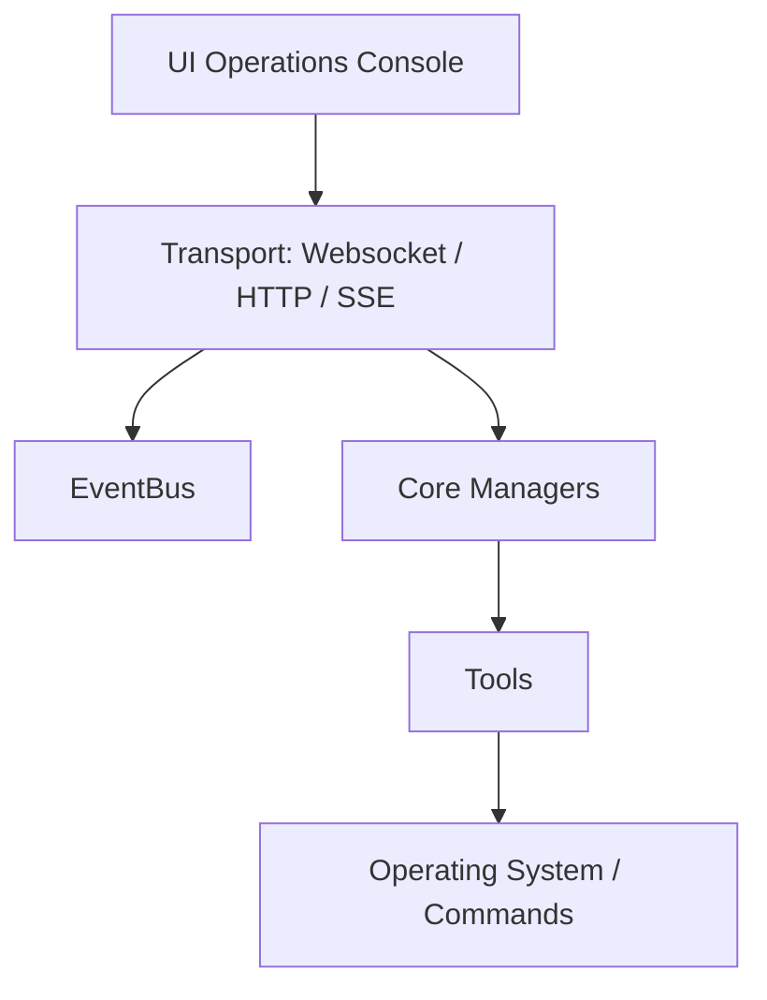

# MAX Agent Backend Architecture Specifications

This document defines the server architecture, structural boundaries, and strict import constraints.

## Dependency Boundary Diagram

## Layer Definitions & Rules

### 1. UI Operations Console
- **Scope**: Frontend client interfaces (HTML/CSS/JS).
- **Import Rules**: May query Transport APIs via versioned REST paths or subscribe to real-time events over SSE. Must not access Python memory or call modules directly.

### 2. Transport Layer (`server/websocket_server.py`, `server/http_server.py`)
- **Scope**: Network sockets and REST routing.
- **Import Rules**: Allowed to query Core Managers and publish onto the `EventBus`. Must never import tool executables directly.

### 3. EventBus (`server/event_bus.py`)
- **Scope**: Pub/Sub domain events router.
- **Import Rules**: Must have zero references to network sockets, HTTP servers, or tool logic. Completely decoupled.

### 4. Core Managers (`core/`)
- **Scope**: Persistent systems (passcodes, connections, settings, metrics).
- **Import Rules**: Must never import Transport or UI modules. Decoupled from transport mechanics.

### 5. Tools Layer (`tools/`)
- **Scope**: System automation commands (CmdTool).
- **Import Rules**: Must not import HTTP routers, WebSocket interfaces, or connection managers. Communicates progress back to the orchestrator exclusively via async callbacks.
