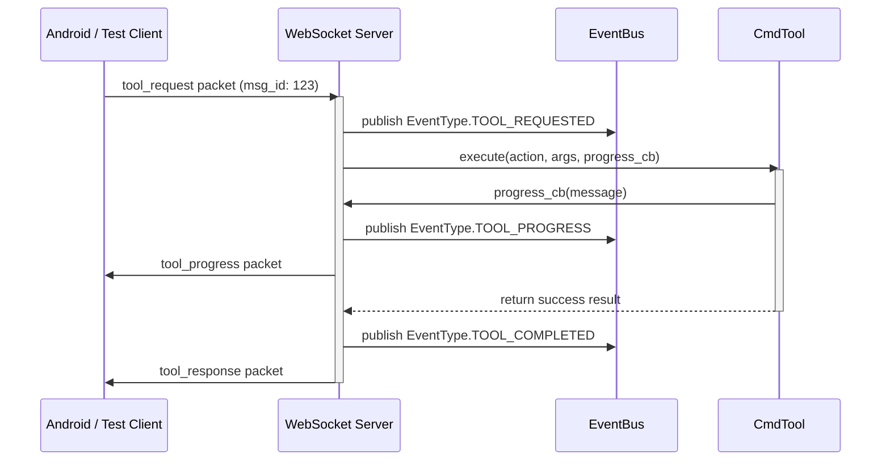

# EventBus Contracts & Sequence Flows

This document details the standardized JSON schemas and publishing sequences for all domain events flowing through the `EventBus`.

## Event Envelope Schema
Every domain event published conforms to this layout:
```json
{
  "schema_version": 1,
  "id": "evt_ab12cd34ef567890",
  "type": "tool_completed",
  "timestamp": 1783939694.123,
  "payload": {
    "device_id": "test-client",
    "tool": "cmd",
    "action": "echo",
    "status": "success",
    "output": "Directory listings"
  }
}
```

## Core Events Registry

| Event Namespace (`EventType`) | Payload Properties | Trigger Point |
|---|---|---|
| `agent_started` | `ws_port`, `http_port` | Async servers startup |
| `agent_shutdown` | None | Async servers exit |
| `client_connected` | `device_id`, `platform`, `device_name` | WebSocket handshake success |
| `client_disconnected` | `device_id` | WebSocket socket drop/exit |
| `pair_started` | `device_id`, `device_name` | Pairing request received |
| `pair_success` | `device_id`, `device_name` | Pairing passcode matched |
| `pair_failed` | `device_id`, `reason` | Incorrect passcode supplied |
| `tool_requested` | `device_id`, `tool`, `action`, `arguments` | Command validation passed |
| `tool_progress` | `device_id`, `tool`, `action`, `message` | Command callback pushed progress |
| `tool_completed` | `device_id`, `tool`, `action`, `status`, `output` | Command finished successfully |
| `tool_failed` | `device_id`, `tool`, `action`, `status`, `error` | Command crashed or returned fail |
| `heartbeat` | `device_id` | Heartbeat check received |

## Tool Execution Sequence Flow


