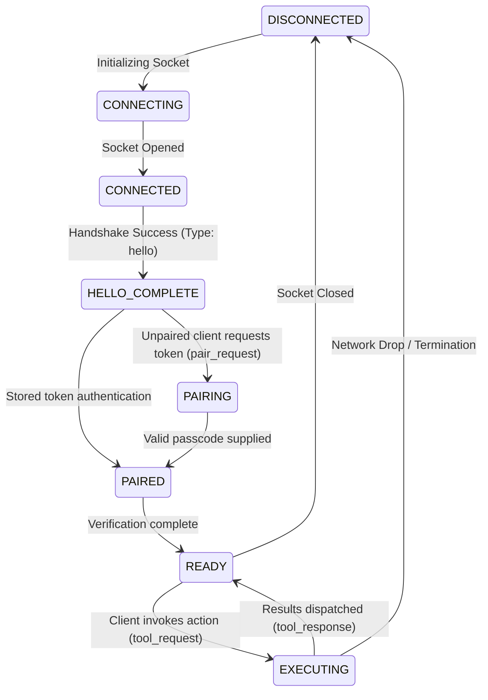

# MAX Windows Agent - Phase 1A Protocol Specification

```text
Status: Frozen
Protocol Version: 1
Implementation Status: Complete
Last Updated: 2026-07-13
```

This document serves as the canonical protocol specification for the **MAX Windows Agent (Phase 1A)**. It defines the communication protocol, transport close codes, timing requirements, state machine, error enums, packet lifecycles, and future reserved structures.

---

## 1. Directory Structure

```text
max-windows-agent/
├── main.py                    # Startup entrypoint and loop orchestrator
├── config.py                  # Environment config settings and storage pointers
├── server/
│   ├── pairing_manager.py     # Random passcode pairings and token records
│   └── websocket_server.py    # Main WebSocket server loop and client logic
├── tools/
│   ├── __init__.py            # Tool registration triggers
│   ├── base_tool.py           # Abstract Base Tool interface
│   ├── cmd_tool.py            # Built-in shell actions (dir, cd, echo, where)
│   └── tool_registry.py       # Global tool registration registry
└── storage/                   # Server-generated state
    ├── config.json            # Loaded JSON configuration parameters
    ├── paired_devices.json    # Paired device tokens database
    └── logs/
        └── max-agent.log      # Active operations logging output
```

---

## 2. Protocol Versioning & Freezing Policy

### 2.1 Protocol Versioning Rules
* **Agent Version**: `1.0.0`
* **Protocol Version**: `1`

Rules:
* **Version Parity**: Client and server must share the exact same `protocol_version` to establish a connection.
* **Higher Protocol Version**: If the client connects with a protocol version higher than the server supports, the server **MUST reject** the connection with transport close code `1003`.
* **Lower Protocol Version**: If the client connects with a protocol version lower than the server supports, the server **MUST reject** the connection with transport close code `1003`.
* **Unknown Packet Type**: If either endpoint receives an unrecognized packet type, it **MUST ignore** the packet and record a warning in the diagnostics log, rather than terminating the connection.

### 2.2 Protocol Freezing Policy
* Packet formats for `protocol_version = 1` are locked.
* Any changes to message fields, new required fields, or layout changes will require incrementing the protocol to `protocol_version = 2`.

---

## 3. WebSocket Transport & Timing Specs

### 3.1 WebSocket Close Codes
For consistent reconnect handling, the transport level uses standard and custom closure codes:

| Close Code | Meaning | Triggering Scenario |
| :--- | :--- | :--- |
| `1000` | Normal Closure | Session ended gracefully by client or server. |
| `1001` | Going Away | Server is shutting down or restarting. |
| `1003` | Unsupported Data | Protocol version mismatch. |
| `1008` | Policy Violation | Authentication token invalid or expired. |
| `1011` | Internal Error | Unhandled server exception or execution crash. |

### 3.2 Protocol Timing Requirements
Both endpoints must adhere to these timing rules:

* **Handshake Timeout**: `10 seconds` (Disconnect if `hello` message isn't completed)
* **Pairing Timeout**: `30 seconds` (Disconnect if pairing code validation fails or times out)
* **Tool Execution Timeout**: `30 seconds` (Default execution limit for tools, return `TOOL_TIMEOUT`)
* **Heartbeat Interval**: `25 seconds` (Ping dispatched every 25 seconds of silence)
* **Heartbeat Timeout**: `60 seconds` (Disconnect if no packet/pong is received for 60 seconds)
* **Reconnect Backoff**: Exponential retry interval backoff for clients:
  * Attempt 1: `1s`
  * Attempt 2: `2s`
  * Attempt 3: `4s`
  * Attempt 4: `8s`
  * Max Interval: `30s`

---

## 4. Connection States & Session Flow

### 4.1 Connection State Machine
The agent manages connection lifetimes across the following structured states:



### 4.2 Session Lifecycle Diagram

```text
Android Client                                 Windows Agent
      │                                              │
      ├────────────────── Connect ──────────────────>│ [State: CONNECTED]
      │                                              │
      ├────────────── Hello (Handshake) ─────────────>│
      │<───────────── Hello Response ────────────────┤ [State: HELLO_COMPLETE]
      │                                              │
      ├───── Pair Request (with 6-digit code) ──────>│
      │<─────────── Pair Response (Token) ───────────┤ [State: PAIRED / READY]
      │                                              │
      │  [ Saves Token in Local Storage ]            │
      │                                              │
      │                                              │
      │==================== USAGE ===================│
      │                                              │
      ├──── Tool Request (Token + Action) ──────────>│ [State: EXECUTING]
      │<───────── Tool Progress Updates ─────────────┤
      │<───────────── Tool Response ─────────────────┤ [State: READY]
      │                                              │
      │                                              │
      │================ RECONNECTION ================│
      │                                              │
      ├─────── Reconnect (Socket Re-open) ──────────>│
      │                                              │
      ├────────────── Hello (Handshake) ─────────────>│
      │<───────────── Hello Response ────────────────┤
      │                                              │
      ├────── Tool Request (Stored Token) ──────────>│ [Token verified by Server]
      │<───────────── Tool Response ─────────────────┤ [State: READY]
```

---

## 5. Packet Lifecycle

### 5.1 Client-Side Packet Lifecycle
1. **Instantiation**: Generate a unique packet transaction UUID.
2. **Serialization**: Convert message payload to JSON string.
3. **Transmission**: Send JSON payload across open WebSocket.
4. **Listen**: Register transaction callback matching transaction UUID.
5. **Timer**: Maintain a 30-second execution timeout.
6. **Cleanup**: Once response returns or timeout triggers, remove the transaction callback.

### 5.2 Server-Side Packet Lifecycle
1. **Ingest**: Read JSON from WebSocket. Parse and validate structure.
2. **Security**: Confirm pairing token is valid (for non-handshake/non-pairing packets).
3. **Resolve**: Check `ToolRegistry` for requested tool capability.
4. **Execute**: Spawn async execution of the tool command.
5. **Feed**: Forward progress status events (if emitted by the tool) back to the sender.
6. **Deliver**: Send back final `tool_response` envelope. Log transaction status.

---

## 6. Packet Layout & Reserved Names

### 6.1 Tool Envelopes

A successful tool execution must return:
```json
{
  "status": "success",
  "output": "Command output content or parameters."
}
```

A failed tool execution must return:
```json
{
  "status": "failed",
  "error": {
    "code": "ERROR_CODE_STRING",
    "message": "Detailed description of execution failure.",
    "retryable": false
  }
}
```

### 6.2 Error Codes (Frozen Enum)
The following error codes are frozen for Phase 1A:

| Error Code | Triggering Scenario |
| :--- | :--- |
| `AUTH_FAILED` | Pairing code mismatch during registration. |
| `INVALID_PACKET` | Packet does not conform to protocol schemas. |
| `INVALID_TOKEN` | Token is invalid, missing, or expired on an action request. |
| `NOT_FOUND` | The specified file, executable, or action was not found. |
| `UNSUPPORTED_TOOL` | The requested tool name is not registered. |
| `BAD_ARGUMENT` | Missing or invalid arguments passed to a tool. |
| `EXECUTION_EXCEPTION` | Python run-time error occurred during execution. |
| `TOOL_TIMEOUT` | Tool execution exceeded default execution timeout limits. |
| `TOOL_BUSY` | Tool is already executing a long-running action. |
| `INTERNAL_ERROR` | Server-side internal thread or registry crash. |

### 6.3 Reserved Packet Types
To ensure forward-compatibility with Phase 1B/1C and Phase 2, the following packet type identifiers are reserved:

* `heartbeat` / `heartbeat_ack`
* `event` / `event_ack`
* `device_status`
* `conversation_sync`
* `file_transfer`
* `cancel_request` / `cancel_response`

---

## 7. Scope Boundaries

### 7.1 Phase 1A Scope Capabilities
* **✓ Single Windows Agent**: Operates locally on one PC target.
* **✓ Single Android Client**: Supports active connection from one pairing device at a time.
* **✓ Local Area Network (LAN)**: Direct socket connection over local Wi-Fi.
* **✓ CMD Tool**: Execution of directory lists, active dir changes, status echoes, and binary checks.

### 7.2 Phase 1A Exclusions & Non-Goals
* **✗ Cloud Relay**: No public internet routing, web gateways, or remote tunnels.
* **✗ Multi-device Sync**: No cross-client message relays or state synchronizations.
* **✗ File Transfer**: No binary uploads or folder streaming services.
* **✗ ADB**: No automated Android Debug Bridge connection handlers.
* **✗ Clipboard**: No background clipboard synchronization events.
* **✗ Launcher**: No remote application boot shortcuts.
* **✗ Operations Console**: No HTML Web UIs or HTTP control dashboards.

---

## 8. Milestone Roadmap & Refactoring Guidelines

### 8.1 Execution Roadmap
* **Phase 1B**: Core manager refactors, EventBus implementation, HTTP serving, Operations Console.
* **Phase 1C**: File transfers, ADB integrations, APK management, long-running tasks, progress streams.
* **Phase 2**: Cloud relays, multi-device synchronization, persistent memory contexts.

### 8.2 Architectural Separation (Phase 1B)
To prevent `websocket_server.py` from growing, all connection handlers, authorization mechanisms, and command parsers must follow a decoupled layout:

```text
WebSocket Transport (websocket_server.py)
        │
        ▼
Packet Dispatcher / Router
        │
        ▼
Authentication Middleware
        │
        ▼
Tool Dispatcher
        │
        ▼
Tool Registry / Managers
```
